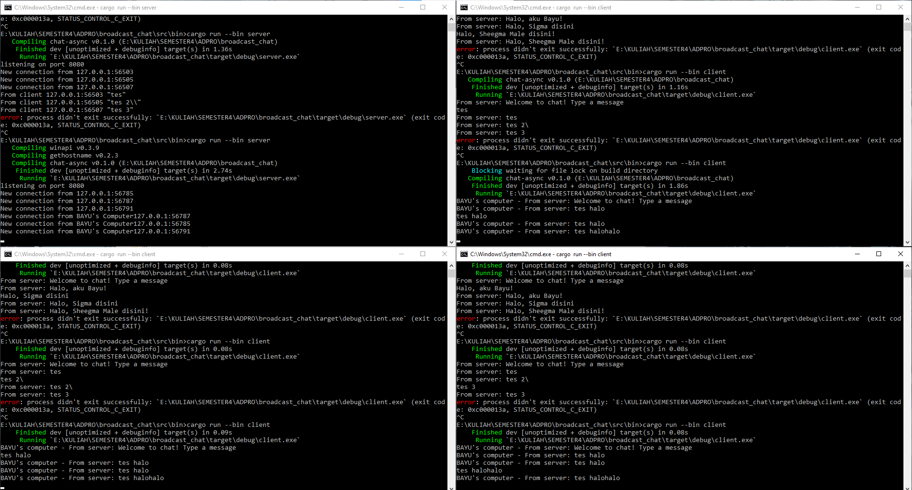

# ADVPROG MODULE 10 - Broadcast Chat
### Rizqi Bayu Utama - 2206826330

    Bisa dilihat pada gambar bahwa pesan terkirim pada satu server, untuk menjalankan server kita bisa menggunakan perintah `cargo --bin server` dan untuk menjalankan client kita bisa menggunakan `cargo --bin client`

    Terlihat ketika sudah diganti menjadi port 8080 dapat berjalan dengan normal. Keduanya baik `server` maupun `client` haruslah memiliki port yang sama agar dapat berjalan bersamaan.
    

    Dari gambar terlihat kalau terdapat informasi dari setiap sender. Disini saya mendapatkan nama hostname dengan menggunakan dependency `gethostname`. Juga, saya perlu mengganti print statement agar dapat menampilkan hostnamenya.